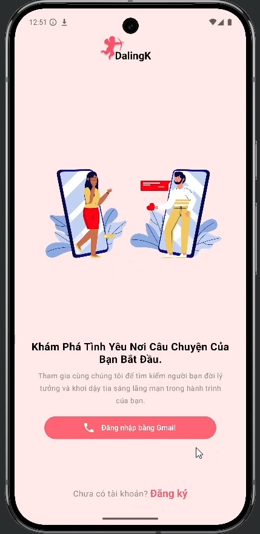
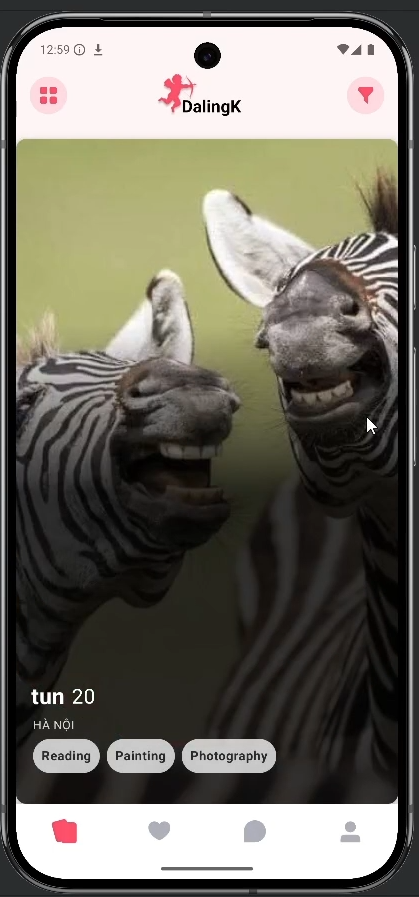
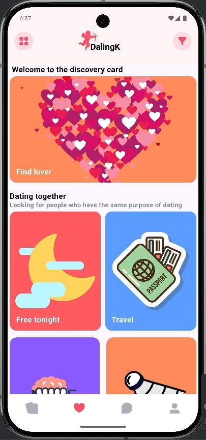
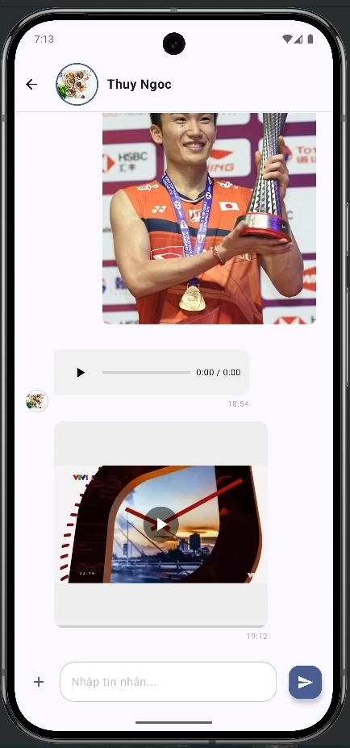
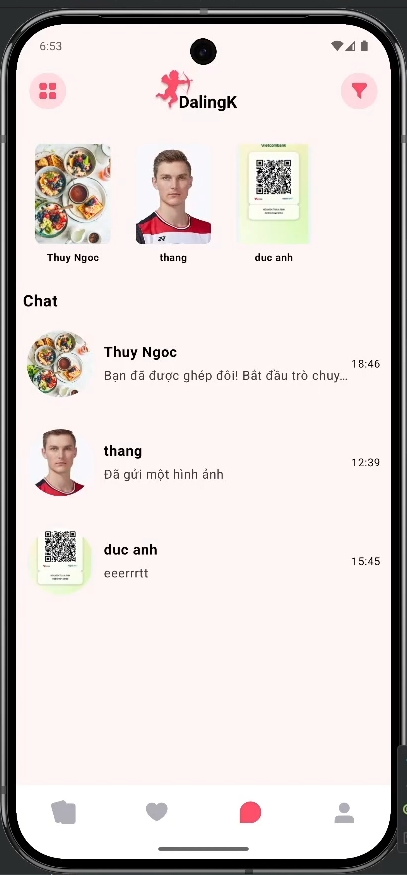
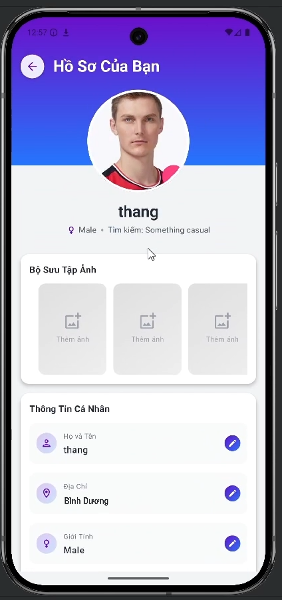

# 💘 DalingKapp - Android Dating Application


**DalingKapp** is a modern dating app built with **Kotlin** and **Jetpack Compose**, featuring smooth native UI, real-time messaging, and offline capabilities.

---

## 📸 App Screenshots

### 1. Core Flow

| Login | Main Swipe (Dashboard) | It's a Match! |
|:---:|:---:|:---:|
|   |  | |

### 2. Connection & Setup

| Chat Conversation | Chat List |  |
|:---:|:---:|:---:|
|  |  |  |

---

## 🌟 Key Features

### 1. Auth & Profile
* **Secure Auth:** Firebase Email/Password login with seamless Firestore sync.
* **Rich Media:** Integrated **Cloudinary** for high-quality photo/video uploads.
* **Smart Profiles:** Detailed user attributes (Interests, Location) with input validation.

### 2. Smart Matching
* **Swipe Interface:** Intuitive "Like/Dislike" card animations.
* **Algorithm:** Matches based on shared interests and preferences.
* **Mutual Connect:** Instantly creates a chat room when likes are reciprocal.

### 3. Advanced Chat
* **Offline-First:** Hybrid architecture (**Firebase** + **Room**) ensures access without internet.
* **Multimedia:** Send text, images, and voice messages seamlessly.
* **Background Sync:** Reliable message syncing and notifications via background services.

### 4. Essentials
* **Security:** Backend protected by Firebase App Check.
* **Localization:** Built-in support for multiple languages.

---

## 🛠️ Tech Stack

| Category | Technology |
| :--- | :--- |
| **Language** | Kotlin |
| **UI** | Jetpack Compose (Material 3) |
| **Backend** | Firebase (Auth, Realtime DB, Firestore, App Check) |
| **Media** | Cloudinary |
| **Local DB** | Room Database |
| **Async** | Coroutines & Flow |

---

## 📂 Project Structure

```text
com.example.dalingk
├── auth/                   # Login/Register logic
├── components/             # Reusable UI (Cards, Buttons)
├── data/
│   ├── chat/               # Room DB, Sync Service
│   ├── model/              # Data Models
│   └── repository/         # Data Handling
├── navigation/             # Navigation Graph
└── screens/                # Main Screens (Home, Chat, Profile)

---